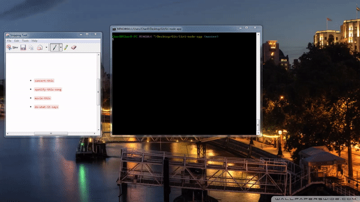

# liri-node-app

LIRI is a Language Interpretation and Recognition Interface. LIRI will be a command line node app that takes in parameters and gives you back data.

LIRI will search Spotify for songs, Bands in Town for concerts, and OMDB for movies.

### What Each Command Would Do

1. `node liri.js concert-this <artist/band name here>`
 * This will search the Bands in Town Artist Events API, and it will show the following information about each event:
     * Name of the venue

     * Venue location

     * Date of the Event (use moment to format this as "MM/DD/YYYY")
 * Example:
   
     

2. `node liri.js spotify-this-song '<song name here>'`

   * This will show the following information about the song in your terminal/bash window

     * Artist(s)

     * The song's name

     * A preview link of the song from Spotify

     * The album that the song is from

3. `node liri.js movie-this '<movie name here>'`

   * This will output the following information to your terminal/bash window:

     ```
       * Title of the movie.
       * Year the movie came out.
       * IMDB Rating of the movie.
       * Rotten Tomatoes Rating of the movie.
       * Country where the movie was produced.
       * Language of the movie.
       * Plot of the movie.
       * Actors in the movie.

4. `node liri.js do-what-it-says`
